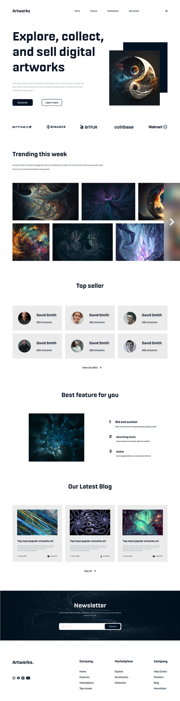

# Artwork Landing Page

This is a landing page project built from a Dribble design using HTML, SCSS, and JS. This is my 3rd web page built, and the images used in this project came from DeviantArt. I spent around 15 hours to build it.

## Installation

- Clone the repository to your local machine
- Run `npm install` to install the necessary dependencies
- Run `npm start` to start a local development server

## Technologies Used

- HTML
- SCSS
- JavaScript

## Live View

A live view of this landing page can be viewed [here](https://oreldx.github.io/DRIBBLE_ArtworksLandingPage/). This will allow you to see the website as it would appear when it is deployed to a live server.

Please note that the live view link may not always be available, as the project is for demonstration purposes only and the hosting may expire or be taken down.

## Design

The design used for this landing page project was taken from [Dribbble](https://dribbble.com/shots/20447516-Digital-art-landing-page). 

The design image used in this project is named `design.webp` and it is located in the root folder of the project. I tried to respect the original design ideas and adding responsive behaviors to it.

## Credits
- The design and inspiration of this project came from [Dribbble](https://dribbble.com/shots/20447516-Digital-art-landing-page)
- The images were taken from [DeviantArt](https://www.deviantart.com/)
- The development was made with [VSCode](https://code.visualstudio.com/) as a code editor

## Notes

- The images used in this project are from DeviantArt and are used for demonstration purposes only.
